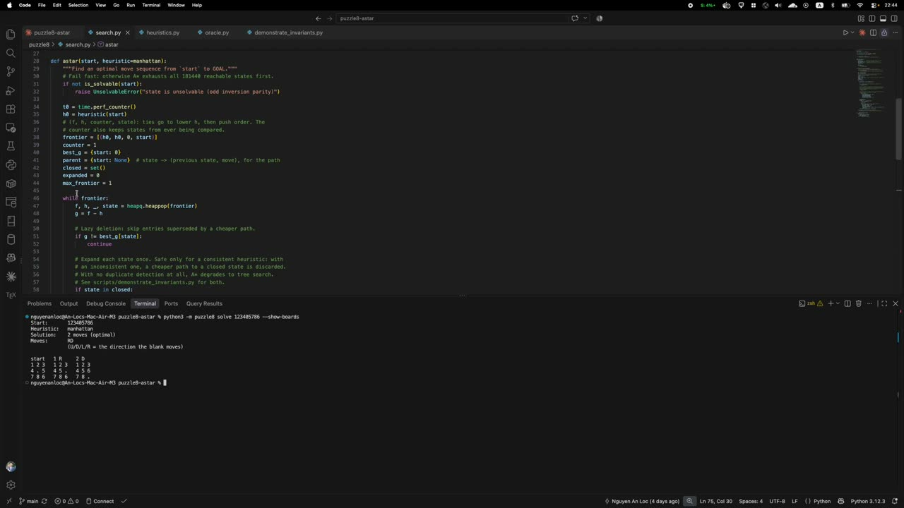

# puzzle8-astar

An optimal solver for the 8-puzzle (the 3×3 sliding-tile puzzle), using A*
search with two heuristics: **Manhattan distance** and **Manhattan + Linear
conflict**. A BFS of the whole state space gives the true
optimal distance of all 181,440 solvable states, and everything is checked
against it. The 8-puzzle was chosen over the 15-puzzle because its state
space is small enough to verify every state exhaustively.

It also includes a command-line tool and a comparison of the work each
heuristic saves at different puzzle depths. For the findings, including why
linear conflict sometimes expands more nodes than Manhattan, see the report.

## Demo video

[](demo.mp4)

A screen recording (9 min 52 s) of the code and the tool running. Click the
image to play it, or open [demo.mp4](demo.mp4) directly.

## Requirements

- Python 3.10 or newer.
- [pytest](https://pytest.org), only for tests.

There is no install step. Clone the repo and run everything from its
root folder:

```bash
cd puzzle8-astar
python3 -m pip install pytest    # only needed for the tests
python3 -m puzzle8 --help
```

## How states are written

A state is 9 digits, read row by row, with `0` for the blank. The goal is
`123456780`:

```
1 2 3
4 5 6
7 8 .
```

A solution is a string of `U`, `D`, `L`, `R`: the direction **the blank**
moves. `L` means the blank slides left and the tile beside it slides right.

## Quick start

**1. Get a puzzle** exactly 20 moves from solved:

```
$ python3 -m puzzle8 random --depth 20 --seed 7
461503827
```

**2. Solve it** with search statistics:

```
$ python3 -m puzzle8 solve 461503827 --stats
Start:       461503827
Heuristic:   manhattan
Solution:    20 moves (optimal)
Moves:       URDLLDRRULLDRULURDRD
             (U/D/L/R = the direction the blank moves)

Nodes expanded:   413
Nodes generated:  674
Max frontier:     256
Time:             0.81 ms
```

**3. Solve it with the stronger heuristic.** Add `--heuristic linear`: same
20-move solution, 172 nodes expanded instead of 413.

The commands combine. `random` prints only the state, so this solves a fresh
12-move puzzle:

```bash
python3 -m puzzle8 solve "$(python3 -m puzzle8 random --depth 12)"
```

## Commands

### `solve`

```
python3 -m puzzle8 solve STATE [--heuristic manhattan|linear] [--stats] [--show-boards]
```

| Option | Meaning |
|---|---|
| `STATE` | 9 digits, e.g. `867254301`. Spaced or comma-separated forms work too if quoted: `"8 6 7 2 5 4 3 0 1"`. |
| `--heuristic` | `manhattan` (default) or `linear` (Manhattan + linear conflict). |
| `--stats` | Also print nodes expanded, nodes generated, largest frontier, and time. |
| `--show-boards` | Also print every board along the solution. |

Every solution is replayed from the start state before it is printed.
Unsolvable states are rejected before any search:

```
$ python3 -m puzzle8 solve 213456780
Unsolvable: 213456780 has 1 inversion (odd).
Every move keeps the inversion count's parity, and the goal has 0,
so only states with an even count can reach it. No search was run.
```

Bad input gets a one-line message, e.g. `error: expected 9 tiles, got 8`.

### `random`

```
python3 -m puzzle8 random --depth D [--seed S]
```

Prints one state exactly `D` moves from the goal (0 to 31), chosen uniformly
from all such states by the oracle. `--seed` makes the choice repeatable.

### `compare`

```
python3 -m puzzle8 compare [--per-bucket N] [--seed S] [--csv PATH]
```

Samples `N` states (default 20) in each of four depth buckets: shallow
(5–10 moves), medium (15–20), deep (21–24) and hard (25–31). Each state is
solved with both heuristics, and every path must match the oracle's optimal
length or the command stops with an error. `--csv` writes one row per state.
Without `--seed`, the command picks one and prints it, so any run can be
repeated. Node counts repeat exactly for the same seed; times do not.

Example output (medium and deep buckets omitted here):

```
$ python3 -m puzzle8 compare --seed 41052
                                 nodes expanded     nodes generated        time (ms)
bucket   depths   n  heuristic    median      mean    median      mean    median      mean
shallow  5-10    20  manhattan       7.5       8.4      17.5      17.7      0.02      0.02
                     linear          7.5       8.2      17.5      17.4      0.03      0.03
                     ratio          1.00      1.02      1.00      1.02      0.65      0.67
...
hard     25-31   20  manhattan    3498.5    4078.2    5492.5    6336.2      6.75      7.82
                     linear       1800.5    2155.3      2856    3396.4      4.89      5.90
                     ratio          1.94      1.89      1.92      1.87      1.38      1.33

ratio = manhattan / linear: above 1 means linear did less work.
```

### Exit codes

| Code | Meaning |
|---|---|
| 0 | Solved, or `random` / `compare` finished. |
| 1 | The state is unsolvable (rejected before any search). |
| 2 | Bad input: malformed state, unknown option, impossible depth, CSV path that can't be written. |
| 3 | Internal error, i.e. a bug. Reported as one line, never a Python traceback. |

## Running the tests

```bash
python3 -m pytest
```

This runs 147 tests in about 10 seconds. Where feasible, the tests check
properties over **all 181,440 solvable states**, not a sample:

| File | What it checks |
|---|---|
| `tests/test_board.py` | Parsing (including rejection of non-ASCII digits), moves, the solvability rule. |
| `tests/test_oracle.py` | The BFS finds exactly the 181,440 even-parity states, and the longest optimal solution is 31 moves. |
| `tests/test_heuristics.py` | On every state, both heuristics never overestimate, are consistent, and match a from-scratch recalculation. |
| `tests/test_search.py` | A* matches the oracle on 200 random states and both 31-move puzzles. Every path is replayed, not trusted. |
| `tests/test_heuristic_comparison.py` | Both heuristics give identical optimal lengths, and the 12 states where linear conflict expands more nodes behave as the report describes. |
| `tests/test_bench.py` | Sampling hits exact depths, and a wrong or illegal path stops the comparison. |
| `tests/test_cli.py` | Every command, flag and exit code, including that no traceback ever reaches the user. |

## Other scripts

Hand-checkable printouts, run from the repo root:

| Script | Shows |
|---|---|
| `scripts/check_solvability.py` | The inversion-parity rule, with every inverted pair listed. |
| `scripts/check_oracle.py` | Short move sequences from the goal, with the oracle's distance and the heuristic's estimate at each step. |
| `scripts/demonstrate_invariants.py` | What breaks without A*'s safeguards (duplicate detection, consistency with a closed set). |

## Project layout

| File | Role |
|---|---|
| `puzzle8/board.py` | States, parsing, moves, solvability (inversion parity). |
| `puzzle8/oracle.py` | Breadth-first search out from the goal: the true distance of every solvable state. It shares no code with A*. |
| `puzzle8/heuristics.py` | `manhattan` and `linear_conflict`. |
| `puzzle8/search.py` | A*: a heap ordered by (f, h, insertion order), lazy deletion, goal test on pop, closed set. |
| `puzzle8/bench.py` | The depth-bucketed comparison. |
| `puzzle8/cli.py` | The command-line interface (`python3 -m puzzle8`). |